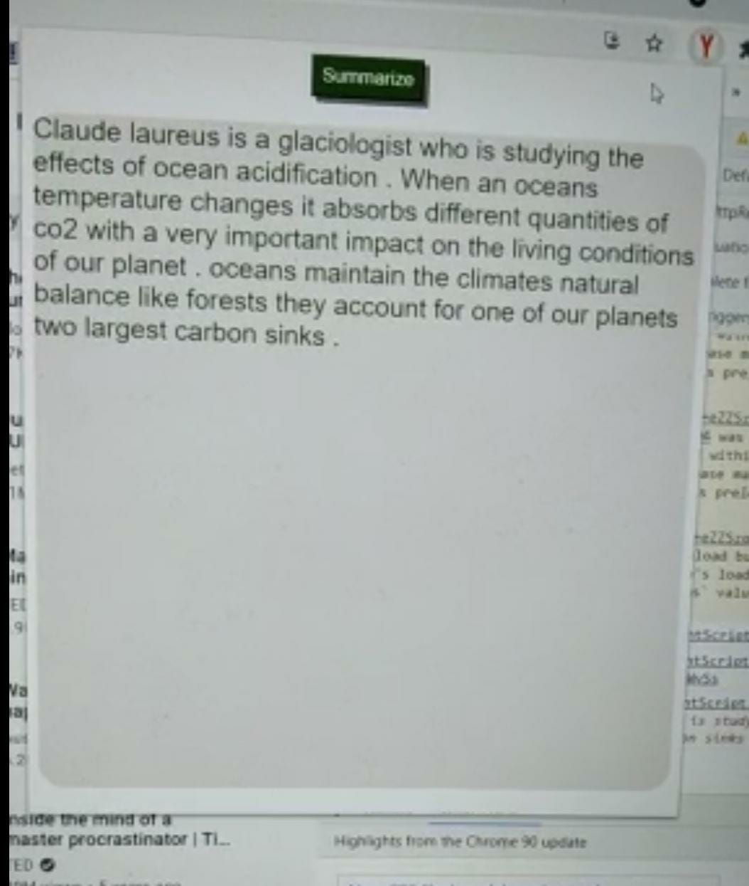

# Youtube Transcript Summarizer

A chrome extension to produce summary of transcripts based on youtube videos.
This uses Flask framework as a back-end to receive API calls and then respond with the summarized text response. This API can work only on those YouTube videos which has captions in it.


[](https://github.com/tterb/atomic-design-ui/blob/master/LICENSEs)


## Setting up project

#### Adding a virtual environment 
Set up your virtual environment by running following commands
```
$ pip install virtualenv
$ virtualenv <my_env_name>
$ <my_env_name>\Scripts\activate
```

#### Clone the project

```bash
  git clone https://link-to-project
```
#### Running server
````
$ cd my-project
$ pip install requirements.txt
$ python app.py

````

